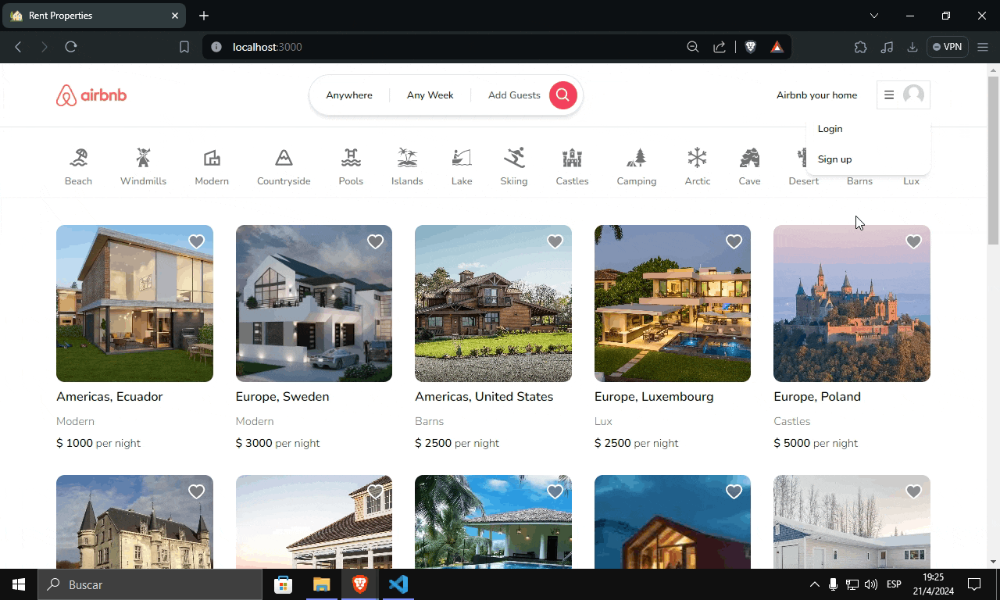

# Airbnb clone

This is a clone of the official Airbnb clone

**Deployment**: [Airbnb Clone 🏡](https://rent-properties-now.vercel.app/)

🚨 **Attention: Test account** 🚨

Take into account that **_if you want to test all the features of the app in production, you MUST create an account with credentials_** because the sign up and login with Google and Github do not work in production (they only work locally)

## Installation

Clone the project

```bash
git clone https://github.com/peterjbone/airbnb-clone.git
```

Install the dependencies

```bash
npm install
```

Set the Prisma with MongoDB Atlas

```bash
npm i --save-dev prisma@latest
npm i @prisma/client@latest
npx prisma db push
```

## Set the environment variables

- DATABASE_URL
- NEXTAUTH_SECRE
- GITHUB_ID
- GITHUB_SECRET
- GOOGLE_CLIENT_ID
- GOOGLE_CLIENT_SECRET
- NEXT_PUBLIC_CLOUDINARY_CLOUD_NAME

## Features 👀

- Search and explore accommodations
- Apply combined filters with buttons or in the search bar
- Create account with credentials
- Create and manage reservations for your trips ⭐
- Create and manage your favorite accomodations ⭐
- Create a listing to rent your property ⭐
- Manage your properties ⭐
- Manage the reservations in your properties ⭐

## Captures of the app

### Desktop version


### Mobile version


### Login with credentials


### Login with google



### Create a listing to rent your property


### Search and explore accommodations


### Apply combined filters with search bar


### Favorites


## Tech

- [Next JS](https://nextjs.org/)
- [Tailwindcss](https://tailwindcss.com/)
- [Typescript](https://www.typescriptlang.org/)
- [Prisma](https://www.prisma.io/)
- [MongoDB](https://www.mongodb.com/)

## License

[MIT](https://choosealicense.com/licenses/mit/)
